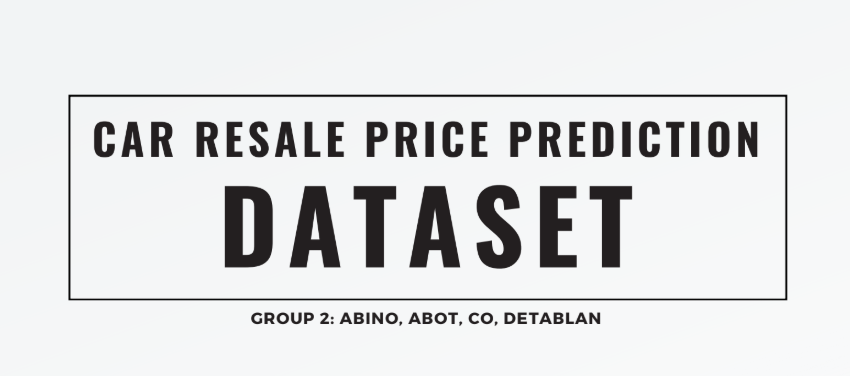
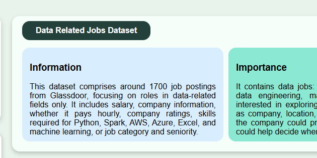

# Portfolio 

This portfolio contains projects that I have done academically during my stay in De La Salle University, and some in my own time. In this portfolio, this summarizes my skills mostly in computer related courses.

- DLSU email: renz_abino@dlsu.edu.ph
- Main email: renzwendellabino@gmail.com
- LinkedIn: https://www.linkedin.com/in/renz-wendell-abi%C3%B1o-4327322b9/
- Resume: https://drive.google.com/file/d/1dfYKB3zdNFuWAyR4ZkwFtq3mB18_3qv3/view?usp=sharing

# Organizations explored at De La Salle University
- Mathematics Circle
- Viridus Arcus

# Organization as an officer at De La Salle University
- Council of Students Organizations: Associate Vice Chairperson in Finance

# Projects

Here below lies some of the projects that I consider that have contributed and built my skills. All of these are projects that were requirements of some courses
at De La Salle University.
---

    
    

        <h3><a>Sales Dashboard</a></h3>
        

            After finishing my last term in DLSU and while waiting for my graduation, I figured I learn Power BI. This project showcases querying, data preparation and transformation, and data visualization using SQL, Power Query, and Power BI, respectively. To view the dashboard, locate and download **Sales Dashboard.pbix** in one of the uploaded files in this portfolio.
        

    

---

---

    
    

        <h3><a href="https://github.com/wendellabino07/linearModellingLaptops.git">Regression Analysis on Laptops Using Linear Modelling</a></h3>
        

            We were tasked to do a regression analysis on whatever dataset that we can think of. Eventually,
            we landed on laptop prices datasets. Through the use of linear modelling and other concepts taught in class, we analyzed which
            properties of a laptop affect the price. Through carefully setting up the predictors and the price (what is being predicted),
            we were able to get insights on what properties of the laptop that we should look out for. For full details, check out
            the project's video presentation through this link: https://www.youtube.com/watch?v=yhJ7f54lfb4.
        

    

---

    
    

        <h3><a href="https://drive.google.com/file/d/1Pqd-zGadvEXCwlCHgrN_qEsp0iW8s-a9/view?usp=sharing">Data Preparation</a></h3>
        

            In this final project in the course DATAPRE with my groupmates, we focused on preparing data for analysis starting with web scraping to collect raw data from some car resale websites in the Philippines. We then performed data cleaning, transformed the data and merged it with an existing data that we looked out for to provide more comprehensive insights. Then, we converted categorical variables into numerical representations using one-hot encoding, frequency encoding, and etc. to ensure that the data was ready to be used for machine learning models or statistical analysis. Check out the final dataset in the files here.
        

    

---

    
    

        <h3><a href="https://github.com/wendellabino07/personalDashboard.git">Personal Dashboard</a></h3>
        

            This dashboard is a little project that I have done as exercise. In this dashboard, it includes my profile, almost everything about my 
            college credentials, and a brief introduction explain why I chose the dataset of data related jobs. Apart from that, there is a map 
            graph there connected with the two other subgraphs below that could give insights about what job openings there should I pursue. 
            To see the dashboard itself, check out the respository by clicking the title of this section.
        

    

---

    
    

        <h3><a href="https://github.com/markusreynoso/datanvi_final_proj.git">An Integrated View of House Pricing, and Seismic Events</a></h3>
        

            This is a data visualization app that uses a dataset we retrieved from Kaggle, in which we cleaned and transformed it accordingly. 
            The purpose of the project is, there are always people looking to buy a house in the Philippines. It is a very important financial 
            decision, and of course, you want the area to be safe. The visualization app shows the exact locations and prices of the houses available, 
            and the summarized graphs pertaining to earthquake. With this, people can draw meaningful insights considering price, location, and earthquake.
        

    

    
    

        <h3><a href="https://github.com/wendellabino07/CSINTSY_MC01.git">Sokobot Puzzle Solver</a></h3>
        

            With my groupmates/friends, we have worked together as tasked in our Artificial Intelligence class to create a bot to solve Sokoban Puzzles. With one of our groupmates' codes of the structure
            and backbone of this project, he tasked us to complete the codes that forces the bot to move in a certain way at specific instances. It would be
            clearer if you try to play Sokoban first here: https://www.mathsisfun.com/games/sokoban.html, then check out our project by clicking the title 
            of this section.
        

    

